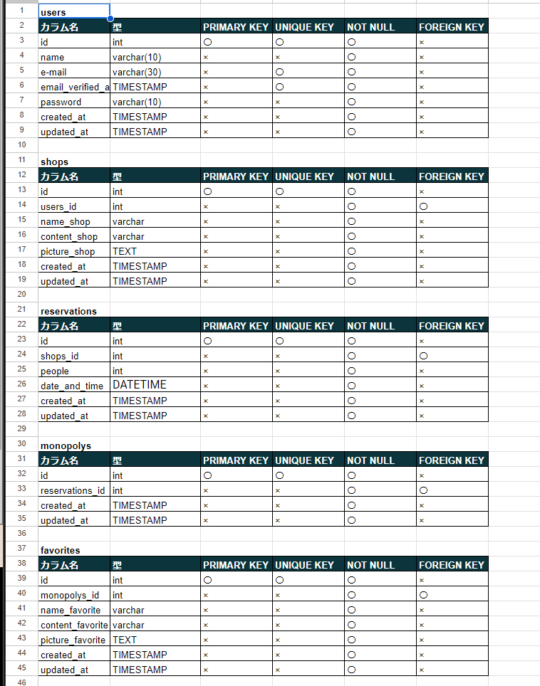

# アプリケーション名
Rese（リーズ）

**概要説明**

ある企業のグループ会社の飲食店予約サービス
## 作成した目的
外部の飲食店予約サービスは手数料を取られるので自社で予約サービスを持ちたい。
## アプリケーションURL
http://localhost/login
## 他のリポジトリ
なし
## 機能一覧
・会員登録

・ログイン

・ログアウト

・ユーザー情報取得

・ユーザー飲食店お気に入り一覧取得

・ユーザー飲食店予約情報取得

・飲食店一覧取得

・飲食店詳細取得

・飲食店お気に入り追加

・飲食店お気に入り削除

・飲食店予約情報追加

・飲食店予約情報削除

・エリアで検索する

・ジャンルで検索する

・店名で検索する

## 使用技術
**フレームワーク**

Laravel Framework 8.83.8

**言語**

PHP

**DB**

MySQL
## テーブル設計

## ER図

## 環境構築
**GitHub　URL**

https://github.com/noihora/edc.git

**クローン**

git clone git@github.com:noihora/edc.git
